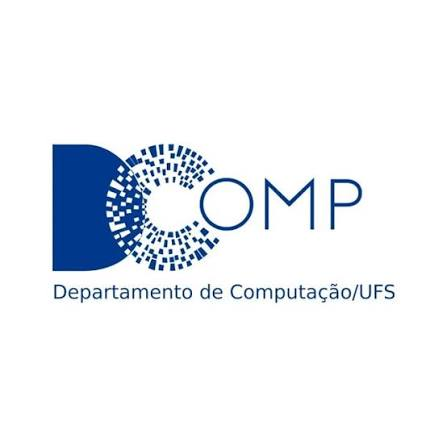
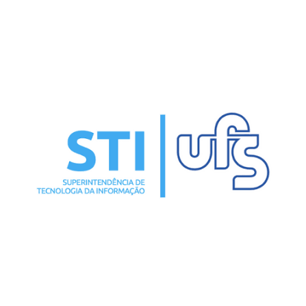
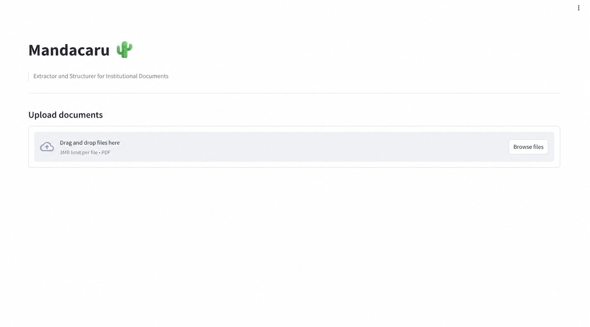
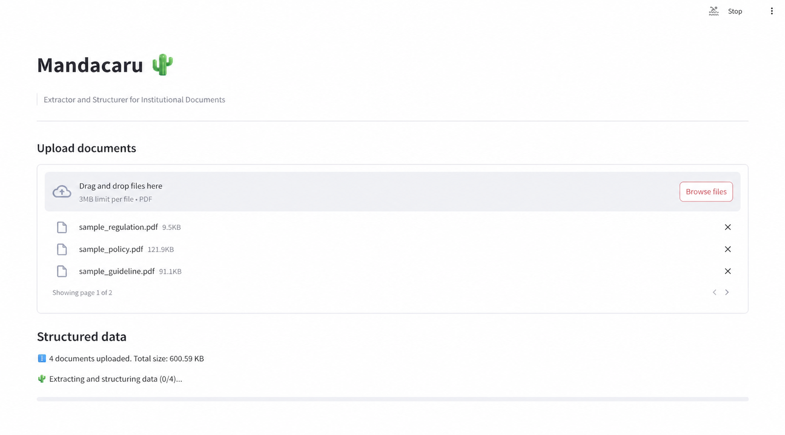
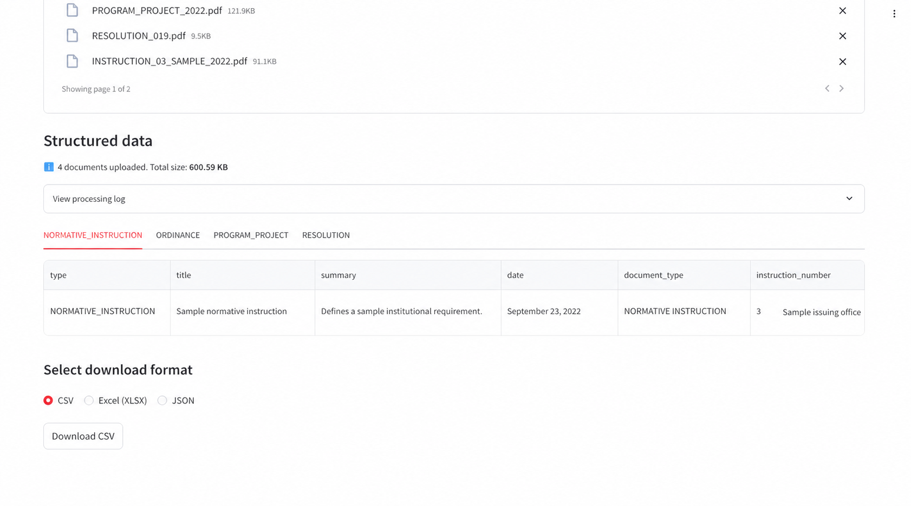
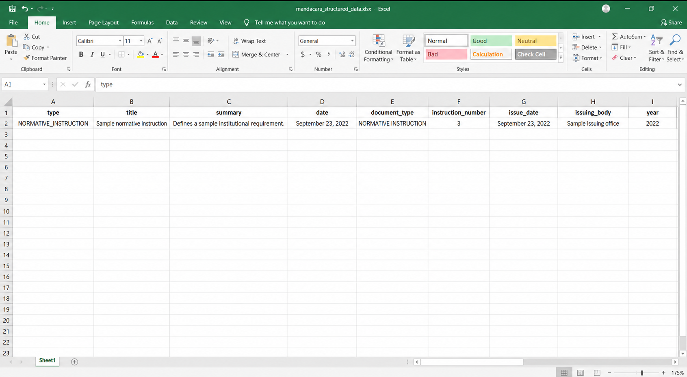
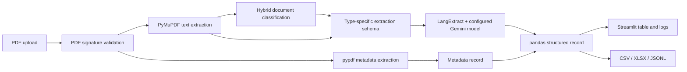
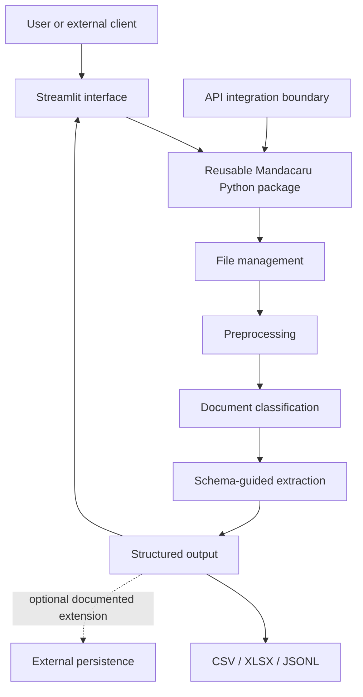

<p align="center">
  <a href="https://github.com/DCOMP-UFS"></a>
  <a href="https://www.ufs.br/"></a>
  <a href="https://stic.ufs.br/pagina/20306"></a>
</p>

# Mandacaru

> Intelligent document processing and data structuring for higher education

<p align="center">
  
</p>

[](docs/README.md)
[](https://www.python.org/)
[](https://streamlit.io/)

Mandacaru is an intelligent document-processing application developed in the context of the Information Technology Superintendency (STI) of the Federal University of Sergipe (UFS). It was designed to transform institutional PDF documents into structured, reusable information through a Python processing package, a Streamlit interface, language-model-assisted extraction, validation workflows, and engineering documentation.

The product story is best understood as **Motivation -> Documentation -> Product -> Impact**. The repository shows a real product-development and engineering effort centered on intelligent document extraction and structured data delivery.

## Overview

Mandacaru addresses the friction of working with institutional documents created primarily for human reading. Resolutions, ordinances, normative instructions, and undergraduate course pedagogical projects can contain important identifiers, dates, issuing bodies, decisions, signatures, and full text, but those fields are difficult to reuse when they remain trapped in PDF layouts.

The application was developed for the STI/UFS context. This establishes the institutional problem environment; it does not imply university-wide adoption, production scale, official endorsement, or measured operational results beyond the evidence documented here.

| Motivation | Documentation | Product | Impact |
| --- | --- | --- | --- |
| Make institutional PDFs easier to process and reuse. | Requirements, architecture, manuals, validation, issues, and benchmarks. | Upload PDFs, classify documents, extract fields, inspect tables, and export data. | Demonstrated structured-processing flows and technical evaluation; potential reduction of manual document work. |

## Motivation and Context

### STI and UFS

Mandacaru was developed as an application in the context of **[STI - Information Technology Superintendency](https://stic.ufs.br/pagina/20306), [Federal University of Sergipe (UFS)](https://www.ufs.br/)**. The project materials frame the need around institutional information that must be organized, processed, and made more accessible to people and systems.

The public case study uses this context carefully: it explains why the problem mattered without claiming that Mandacaru was deployed across the university or that it produced unmeasured institutional gains.

### The Problem

Administrative and academic teams may need to read official documents and manually transfer relevant fields into spreadsheets or other systems. That workflow is repetitive, difficult to scale, and vulnerable to transcription inconsistencies.

Mandacaru was designed to reduce this friction by combining file validation, text and metadata extraction, document classification, schema-guided field extraction, and structured export.

## From Documentation to Product

The project was developed through a sequence of product and engineering activities:


The repository includes evidence of problem framing, value proposition work, requirements, UML views, architecture, coding standards, a user manual, deployment material, validation scripts, issue records, integration reports, release demonstrations, and model benchmarking.

## Product Experience

The user-facing workflow is intentionally direct:

1. Upload one or more PDF documents.
2. Let the system validate the input and extract available text and metadata.
3. Review the detected document type and processing status.
4. Inspect structured results in a table grouped by type.
5. Download CSV, XLSX, or JSONL output for further use.

The project documentation describes support for resolutions, ordinances, normative instructions, undergraduate course pedagogical projects, and a generic metadata fallback. The interface also exposes progress information and processing logs for multi-file workflows.

## Product Demo

The following sanitized screenshots show the documented product flow with generic sample data: upload documents, process a batch, inspect structured records, and export the result.

<table>
  <tr>
    <td width="50%"><strong>1. Upload documents</strong><br><a href="assets/demo/01-upload-empty.png"></a></td>
    <td width="50%"><strong>2. Process a batch</strong><br><a href="assets/demo/02-processing.png"></a></td>
  </tr>
  <tr>
    <td width="50%"><strong>3. Review structured data</strong><br><a href="assets/demo/03-structured-data.png"></a></td>
    <td width="50%"><strong>4. Export a spreadsheet</strong><br><a href="assets/demo/04-exported-spreadsheet.png"></a></td>
  </tr>
</table>

## How Mandacaru Works



### Document processing pipeline

- **Ingestion:** accepts PDF paths or in-memory file bytes.
- **Validation:** checks the PDF signature and skips invalid inputs.
- **Text and metadata:** reads text with PyMuPDF and PDF metadata with pypdf.
- **Classification:** uses a serialized scikit-learn pipeline with text, page-count, filename, header, and rule-based signals.
- **Extraction:** selects document-specific fields and examples for LangExtract with a configured Gemini model.
- **Structuring:** combines extracted fields and metadata into pandas DataFrames.
- **Delivery:** displays grouped tables and enables CSV, Excel, and line-delimited JSON downloads.

## System Architecture

The documented engineering model separates a reusable Python library from the application layer. The architecture material also describes an API-oriented integration surface and optional external persistence.



The architecture follows a modular data-flow approach. It separates preprocessing, classification, extraction, structuring, and presentation so that the processing core can be reused independently of the interface.

## Product Scope

The public product surface focuses on intelligent document extraction and structured data delivery. Its core value comes from turning institutional PDF content into organized records that can be inspected, downloaded, and consumed by other workflows.

## Engineering and Product Documentation

The public documentation is organized around the most useful evidence rather than exposing the raw delivery archive.

| Resource | What it demonstrates |
| --- | --- |
| [User Manual](docs/user-manual.md) | User journey, supported document types, outputs, and practical limitations. |
| [Architecture Overview](docs/architecture.md) | Components, data flow, boundaries, and architectural decisions. |
| [API and Deployment Guide](docs/api-and-deployment.md) | Integration model, deployment assumptions, configuration, and operational concerns. |
| [Model Benchmarking](docs/model-benchmarking.md) | Evaluation criteria, recorded comparison, interpretation, and engineering value. |
| [Product Development Notes](docs/product-development.md) | Evidence that the work progressed from problem framing to product development. |
| [Engineering Decisions](docs/engineering-decisions.md) | Why the project used modular processing, type-specific schemas, and source-grounded extraction. |

The underlying implementation and original technical records are referenced through the [DCOMP-UFS Mandacaru repository](https://github.com/DCOMP-UFS/2025-1-praticas-mandacaru-extrator-dados), within the [DCOMP-UFS GitHub organization](https://github.com/DCOMP-UFS). This repository is the curated English portfolio layer.

## Benchmarking and Technical Evaluation

The repository contains a benchmark of local language models for PDF-to-CSV extraction. It evaluates:

- CSV validity.
- Header and row conformity.
- Recorded p50 and p95 processing time.
- Trade-offs between response quality, latency, and implementation complexity.

| Model | Recorded p50 / p95 | Valid CSV | Header and row checks |
| --- | ---: | --- | --- |
| Gemma 7B | 176.12 s / 176.12 s | Yes | Passed |
| Mistral 7B | 445.30 s / 445.30 s | Yes | Passed |
| Llama 3 8B | 187.50 s / 187.50 s | No | Failed |

### Problem -> Alternatives -> Experiment -> Decision

The engineering problem was how to obtain structured fields from extracted PDF text while preserving a strict output contract. Alternative local models were evaluated against structural validity and latency. The recorded snapshot did not establish a production-ready winner: Gemma produced the fastest valid output, Mistral produced valid formatting at higher latency, and Llama 3 8B did not satisfy the output contract. The result supports treating local-model integration as an evaluated engineering path rather than a guaranteed production capability.

These numbers describe a repository benchmark snapshot, not a production SLA or statistically representative evaluation. Raw documents, reference spreadsheets, prompts, and credentials remain private.

## Engineering Decisions

The documented design reflects several practical decisions:

- **Reusable core:** keep document-processing logic in a Python package instead of binding it entirely to the web interface.
- **Type-specific schemas:** use different extraction fields and examples for different institutional document types.
- **Source-grounded extraction:** instruct the extraction layer to preserve source wording, avoid invented values, and return structured fields.
- **Interoperable outputs:** produce CSV, XLSX, and JSONL so downstream consumers are not tied to one interface.
- **Defensive input handling:** validate PDF signatures and report file-level processing errors.
- **Operational feedback:** expose progress and logs during multi-file processing.
- **Conservative capability claims:** distinguish implemented extraction from unimplemented semantic retrieval and RAG features.

## Product Development Process

Mandacaru demonstrates a broader development process than an isolated model call:

```text
Problem definition
    -> requirements and product framing
    -> research and model benchmarking
    -> architecture and software specifications
    -> reusable processing package
    -> user interface and export workflow
    -> validation, issues, and integration records
    -> product documentation and deployment guidance
```

The repository evidence includes a value proposition, project planning artifacts, requirements and use cases, UML diagrams, coding standards, architecture, an MVP summary, user and deployment manuals, validation scripts, issue records, integration reports, release material, and technical benchmarking.

## Technology Stack

**Application and language**

Python 3.10+, Streamlit, Docker, and Sphinx.

**Document and data processing**

PyMuPDF, pypdf, pandas, NumPy, openpyxl, XlsxWriter, joblib, and scikit-learn.

**AI-assisted extraction**

LangExtract with a configured Google Gemini model, document-specific examples, and structured extraction fields.

**Engineering practices**

Modular package layout, documented interfaces, PEP 8 and PEP 257 conventions, static-analysis configuration, structured logs, environment-based secret configuration, and concurrent multi-file processing in the interface.

## Repository Structure

```text
.
├── README.md
├── assets/
│   ├── dcomp-ufs.png
│   ├── mandacaru-logo.png
│   ├── sti-ufs-logo.png
│   ├── ufs-logo.png
│   └── demo/
│       ├── 01-upload-empty.png
│       ├── 02-processing.png
│       ├── 03-structured-data.png
│       └── 04-exported-spreadsheet.png
└── docs/
    ├── README.md
    ├── api-and-deployment.md
    ├── architecture.md
    ├── engineering-decisions.md
    ├── model-benchmarking.md
    ├── product-development.md
    └── user-manual.md
```

This is a curated public portfolio repository. The implementation source remains in the original public project reference, while this repository keeps only English documentation and a safe brand asset.

## My Contribution

I was one of the people responsible for developing Mandacaru as a product. Repository evidence supports involvement across:

- Model benchmarking and technical evaluation.
- Product and engineering documentation.
- Architecture, requirements, and development standards as part of the team effort.
- Validation and issue-driven iteration.
- AI-assisted document processing and product communication.

These statements describe documented collaboration. They do not assign sole authorship, leadership, or ownership of components without direct evidence.

## Impact

### Demonstrated results

- A documented PDF-processing workflow exists from input validation to structured export.
- The product supports multiple institutional document categories and a generic fallback path.
- A user-facing Streamlit workflow supports multi-file upload, processing feedback, tabular inspection, and downloads.
- A reusable Python package separates document processing from the interface layer.
- Model alternatives were evaluated using output validity, schema checks, and recorded latency.
- Deployment, API integration, architecture, validation, and user documentation were produced as part of the development effort.

### Potential product impact

The implemented workflow was designed to reduce the friction of locating, copying, organizing, and reusing information found in institutional PDF collections. Potential benefits include more accessible structured records, less repetitive manual document work, and easier integration with spreadsheets, dashboards, databases, or public-information workflows.

These are logical product benefits, not measured STI/UFS outcomes. The repository does not provide evidence for adoption numbers, time savings, cost savings, or university-wide deployment.

## Security and Privacy

This public repository intentionally excludes:

- Videos, audio, and raw media.
- Raw benchmark inputs and outputs.
- Spreadsheets containing test or issue data.
- Personal information and contributor-specific delivery exports.
- Internal URLs, server addresses, credentials, tokens, and secret configuration.
- Untranslated source documents and private institutional material.

Configuration examples use conceptual descriptions only. Secret values must be supplied through protected environment configuration and must never be committed.

## Running the Project

This repository is a curated documentation and portfolio surface. To run the implementation, use the setup instructions in the [source repository](https://github.com/DCOMP-UFS/2025-1-praticas-mandacaru-extrator-dados) and provide the required model configuration through a protected secret manager or environment configuration.

The project records a Streamlit deployment at <https://mandacaru.streamlit.app/>. Availability and authentication can change, so this URL is a historical project reference rather than a guaranteed public demo.
