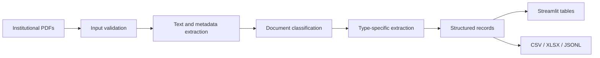

# Mandacaru

> Intelligent document processing and data structuring for higher education

Mandacaru is an intelligent document-processing product that transforms institutional PDF files into structured, reusable data. It combines a reusable Python package, a Streamlit interface, document-specific extraction workflows, model experimentation, validation material, and product documentation.

The project was developed for higher-education institutional documents, including resolutions, ordinances, normative instructions, and undergraduate course pedagogical projects. A generic metadata path supports documents that do not yet have a specialized schema.

## Product Overview

Administrative and academic teams often need to read official documents and manually copy relevant fields into spreadsheets or other systems. Mandacaru reduces that repetitive work by validating PDFs, extracting text and metadata, classifying document types, applying structured extraction schemas, and exporting the result in interoperable formats.

The documented user journey is:

1. Upload one or more PDF files.
2. Validate the file format.
3. Extract text and document metadata.
4. Classify the document type.
5. Extract fields using a type-specific schema and a configured language model.
6. Inspect structured records in a table.
7. Download CSV, XLSX, or JSONL output.

## My Contribution

I was one of the contributors responsible for the development of Mandacaru as a product. Repository evidence supports participation across model benchmarking, product and engineering documentation, validation, issue tracking, and the broader AI-assisted document-processing effort.

The contribution is intentionally described as collaborative. It does not claim individual ownership of every component or artifact in the team project.

## Architecture

The processing design separates file management, preprocessing, classification, extraction, and structuring. The project documentation also describes a reusable-library and API-oriented architecture for integration with external systems.

## Implemented Capabilities

- PDF validation and text extraction.
- Metadata extraction, including full text and page count.
- Classification of resolutions, ordinances, normative instructions, PPCs, and generic documents.
- Schema-guided extraction with LangExtract and a configured Google Gemini model.
- Structured tabular results through pandas DataFrames.
- Multiple-file processing with progress and status logs in the Streamlit interface.
- CSV, Excel, and line-delimited JSON downloads.
- Docker-based deployment guidance and generated technical documentation.

## Technical Scope

The public documentation deliberately distinguishes implemented capabilities from technologies that are not evidenced in the reviewed project:

| Capability | Publicly documented status |
| --- | --- |
| Python | Implemented as the package and application language. |
| OCR | Not claimed. The reviewed processing path extracts text from PDF text layers. |
| NLP | Implemented through classification, schemas, examples, and language-model-assisted extraction. |
| Embeddings | Not evidenced. |
| Vector databases | Not evidenced. |
| Semantic search | Not the product focus; Mandacaru structures documents rather than searching an indexed corpus. |
| Information retrieval | Not claimed as a separate retrieval system. |
| RAG | Not evidenced and not claimed. |
| APIs | Described in architecture and delivery material; deployment must be verified separately. |
| Data pipelines | Implemented from PDF ingestion through structured export. |

## Model Experimentation

The project contains a benchmark of local language models for PDF-to-CSV extraction. It evaluates output validity, schema conformity, latency, and cell-level agreement with a reference output. The recorded snapshot compares Gemma 7B, Mistral 7B, and Llama 3 8B.

The benchmark is presented as an engineering experiment, not as a production performance guarantee. Raw documents, prompts, credentials, and test spreadsheets are not included in this public repository.

## Product Value

Universities and public-sector organizations maintain regulations, policies, course documents, and administrative acts as PDFs. Structuring those records can reduce manual transcription, support reporting and transparency workflows, and make institutional information easier to reuse in data systems.

Potential applications include institutional repositories, academic registries, public-sector information-access workflows, structured catalogs of normative acts, and document-to-dashboard pipelines. These are potential use cases, not claims of customers or commercial scale.

## Public Documentation

- [Documentation index](docs/README.md)
- [User manual](docs/user-manual.md)
- [Architecture overview](docs/architecture.md)
- [API and deployment guide](docs/api-and-deployment.md)
- [Model benchmarking](docs/model-benchmarking.md)
- [Product development notes](docs/product-development.md)

The project records a Streamlit deployment at <https://mandacaru.streamlit.app/>. Availability and authentication can change, so this URL is provided as a historical project reference rather than a guaranteed public demo.

## Source Reference

The implementation source associated with the project is maintained in the [DCOMP-UFS Mandacaru repository](https://github.com/DCOMP-UFS/2025-1-praticas-mandacaru-extrator-dados). This repository is a curated English portfolio and documentation surface.

## Privacy and Publication Scope

This public repository intentionally excludes videos, audio, raw spreadsheets, raw benchmark inputs and outputs, issue exports, personal information, internal URLs, credentials, secret configuration, and untranslated delivery documents. The original local archive remains outside Git and was not deleted.

## Skills Demonstrated

**AI and data:** Python, NLP, language-model-assisted extraction, document classification, structured data generation, model benchmarking, and data pipelines.

**Engineering:** software architecture, modular package design, PDF processing, Streamlit, Docker, logging, deployment documentation, and technical writing.

**Product development:** problem framing, requirements, user workflows, validation, issue-driven iteration, technical evaluation, and product communication.
