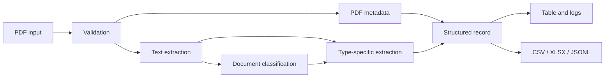

# Mandacaru Architecture Overview

## System Goal

Mandacaru converts unstructured institutional PDFs into structured records that can be displayed, downloaded, or consumed by another system.

## Logical Flow

```text
PDF input
  -> file validation
  -> text and metadata extraction
  -> document type classification
  -> type-specific field extraction
  -> metadata and field consolidation
  -> structured table
  -> CSV, XLSX, or JSONL output
```



## Main Components

### File management

Reads files from paths or in-memory bytes and verifies that the input has a valid PDF signature before processing.

### Preprocessing

Extracts text with PyMuPDF and reads PDF metadata with pypdf. The resulting text and page information become inputs to classification and extraction.

### Document classification

A serialized scikit-learn pipeline combines document text with signals such as page count, filename patterns, headers, and rule-based features. A confidence threshold provides a generic fallback when classification is uncertain.

### Structured extraction

LangExtract uses document-specific fields and examples with a configured Gemini model. The extraction design emphasizes source fidelity, valid structured output, and avoiding invented values.

### Application layer

The Streamlit interface accepts multiple files, processes them concurrently, displays status messages and results, groups records by type, and provides downloads.

## Architectural Decisions

- Keep the core extraction logic reusable as a Python package.
- Separate preprocessing, classification, extraction, and output responsibilities.
- Use document-specific schemas instead of one undifferentiated output format.
- Keep the user interface focused on upload, inspection, and export.
- Use environment-based configuration for model credentials.

## Integration Boundary

Project architecture and deployment artifacts describe an API-oriented integration surface and optional external persistence. Those materials establish an intended integration boundary, while the public runnable interface reviewed for this portfolio is Streamlit-based.
